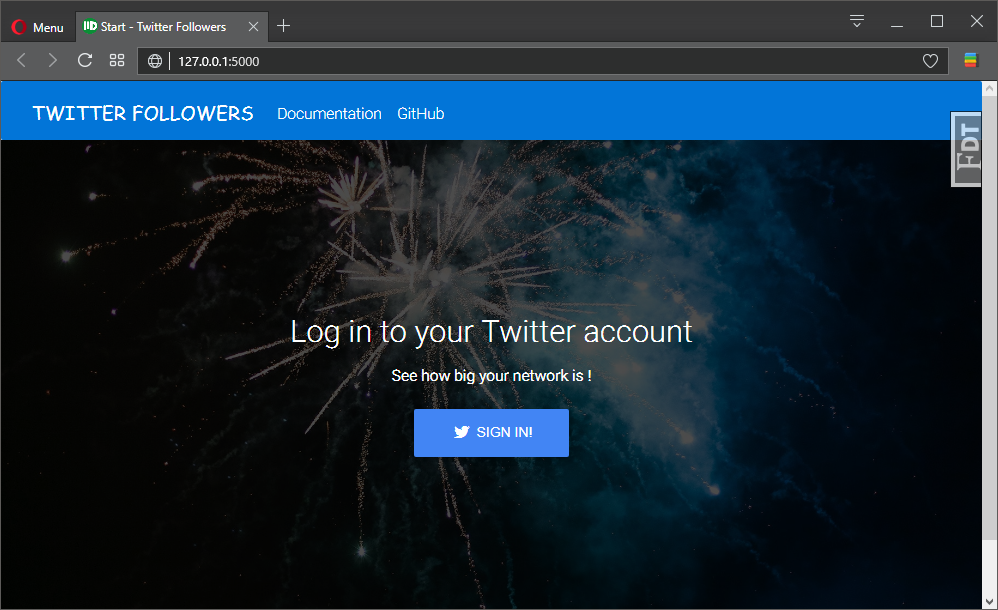
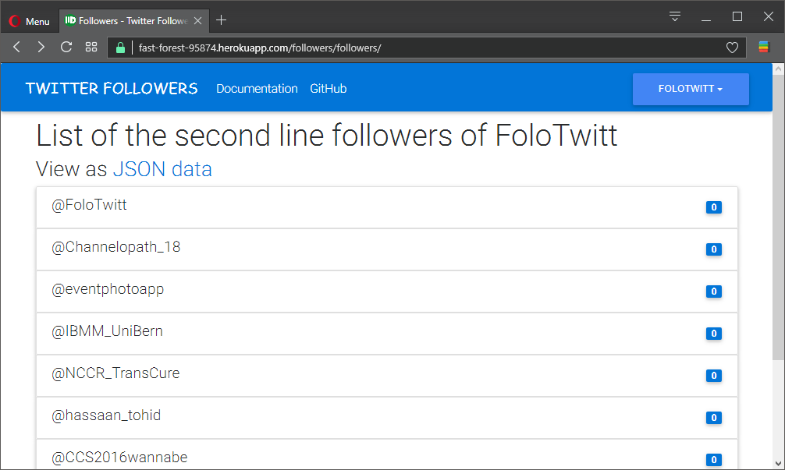

.. quickstart:

Quickstart
==========

A Python app, which display followers of the followers of your Twitter account. Can be deployed to Heroku. 

Application UI based on MDB Free and EBM Bootstrap Plugin, available under MIT License and provided by `MDBoostrap.com <https://mdbootstrap.com>`_.

Usage
-----

1. Visit heroku_app_

2. Sign in with your Twitter account
3. Browse list of followers who follow followers :)

Deploying to Heroku
-------------------
To deploy your copy of application simply click 

|Deploy|

.. warning::
    You will need Twitter app and SECRET CREDENTIALS provided by Twitter in order to make it work.
    See _twitter_dev

You can also quickly deploy using git. Make sure you have Python_ and HerokuCLI_ installed.::

    $ git clone https://github.com/mdyzma/twitter_follo.git
    $ cd twitter_follo
    $ heroku create
    $ git push heroku master
    $ heroku open

Running Locally
---------------

It can be also run locally. Make sure you have Python_ installed properly.  Also, install the HerokuCLI_. ::

    $ git clone https://github.com/mdyzma/twitter_follo.git
    $ cd twitter_follo
    $ pip install --no-cache-dir -r requirements.txt
    $ heroku local

Your app should now be running on `http://127.0.0.1:5000 <http://localhost:5000/>`_.

Documentation
-------------

For more information, i.e. about app further development used approaches, see project's documentation_.

.. links

.. _Python: http://install.python-guide.org
.. _HerokuCLI: https://toolbelt.heroku.com
.. _documentation: http://twitter-follo.readthedocs.io/en/latest/?badge=latest
.. _twitter_dev: https://iag.me/socialmedia/how-to-create-a-twitter-app-in-8-easy-steps/
.. _heroku_app: https://fast-forest-95874.herokuapp.com

.. |Deploy| image:: https://www.herokucdn.com/deploy/button.png
    :target: https://heroku.com/deploy
    :alt: Heroku deploy
